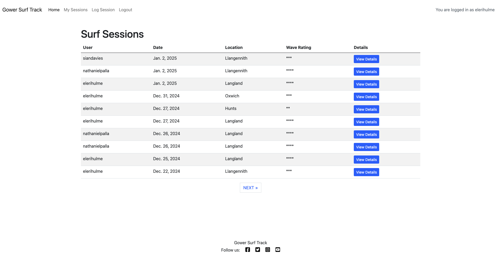
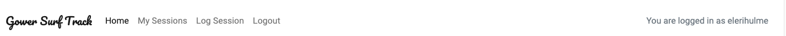
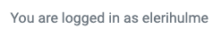
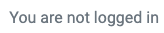
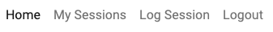
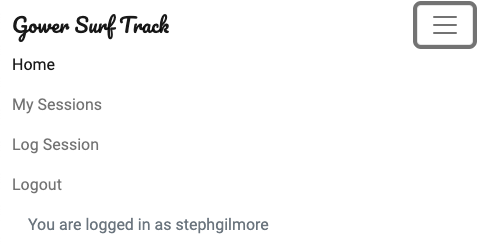
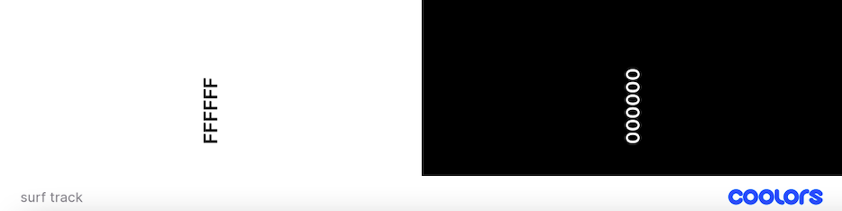
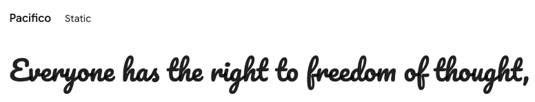
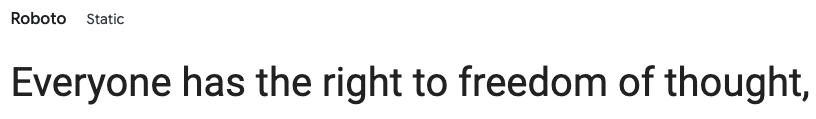

# Gower Surf Track website

**Deployed website: [Link to website](https://surf-track-e46e8d35b2da.herokuapp.com/)**




## About

Gower Surf Track is a community-driven platform for surfers to log, rate, and share their surf experiences. Users can record their surf sessions, track wave conditions, and view surf data from other community members. The site offers insights into surf spots and creates a surf journal to monitor progress over time.

---

## UX

The Surf Track platform is designed with a clean, intuitive interface to provide surfers with an easy and enjoyable experience when logging their surf sessions. The goal is to ensure seamless navigation, allowing users to quickly add, view, and manage their surf logs. By incorporating feedback from the surf community, the platform addresses user needs such as tracking surf conditions, rating surf spots, and sharing insights with other surfers. The responsive design ensures the platform is accessible across all devices, enhancing the experience whether accessed from a phone on the beach or a desktop at home.

### Target Audience

- Surfers of all levels (beginners to advanced)

- Surf enthusiasts looking to track their progress

- People interested in surf forecasting and ocean conditions

### User Stories

#### Site User
| Issue ID    | User Story |
|-------------|-------------|
| [#1](https://github.com/elerihulme/surf-track/issues/1) | As a site user I can view a list of all uploaded surf sessions so that I can discover new spots and learn about surf conditions |
| [#2](https://github.com/elerihulme/surf-track/issues/2) | As a site user I can log surf sessions so that I can track my progress |
| [#4](https://github.com/elerihulme/surf-track/issues/4) | As a site user I can edit or delete my sessions so that I can keep my data accurate and up to date |
| [#5](https://github.com/elerihulme/surf-track/issues/5) | As a site user I can sign up and log in so that I can view the sessions of the community |
| [#11](https://github.com/elerihulme/surf-track/issues/11) | As a site user I can select a session so that I can view the session in more detail |
| [#12](https://github.com/elerihulme/surf-track/issues/12) | As a site user I can view a paginated list of sessions so that I can select which session I want to view |
| [#13](https://github.com/elerihulme/surf-track/issues/13) | As a site user I can learn about the platform's features so that I understand the benefits of joining |

#### Site Owner

| Issue ID    | User Story |
|-------------|-------------|
| [#6](https://github.com/elerihulme/surf-track/issues/6) | As a site owner I can view all the surf sessions and users so that I can monitor activity on the platform |

---

## Future Development

- Filtering sessions to find relevant data easier
- Specific details for each surf location 
- Site admin can remove users and sessions

---


## Technologies used
- ### Languages:
    
    + [Python](https://www.python.org/): the primary language used to develop the server-side of the website.
    + [HTML](https://developer.mozilla.org/en-US/docs/Web/HTML): the markup language used to create the website.
    + [CSS](https://developer.mozilla.org/en-US/docs/Web/css): the styling language used to style the website.
    + [JavaScript](https://developer.mozilla.org/en-US/docs/Web/JavaScript): language used to provide interactivity to the website.

- ### Frameworks:

    + [Django](https://www.djangoproject.com/): python framework used to create all the logic.
    + [Bootstrap](https://getbootstrap.com/): css framework used for structure, styling and responsive design.

- ### Databases:

    + [SQLite](https://www.sqlite.org/): was used as a development database.
    + [PostgreSQL](https://www.postgresql.org/): the database used to store all the data.


- ### Other tools:

    + [Git](https://git-scm.com/): the version control system used to manage the code.
    + [Pip3](https://pypi.org/project/pip/): the package manager used to install the dependencies.
    + [Gunicorn](https://gunicorn.org/): the web server used to run the website.
    + [Psycopg2](https://www.psycopg.org/): the database driver used to connect to the database.
    + [Django-allauth](https://django-allauth.readthedocs.io/en/latest/): the authentication library used to create the user accounts.
    + [Django-crispy-forms](https://django-cryptography.readthedocs.io/en/latest/): was used to control the rendering behavior of Django forms.
    + [GitHub](https://github.com/): used to host the website's source code.
    + [Gitpod](https://www.gitpod.io/): the IDE used to develop the website.
    + [Heroku](https://www.heroku.com/): the platform used to deploy the website.
    + [Chrome DevTools](https://developer.chrome.com/docs/devtools/open/): was used to debug the website.
    + [Font Awesome](https://fontawesome.com/): was used to create the icons used in the website.
    + [Google Fonts](https://fonts.google.com/): was used to provide fonts for the website.
    + [favicon.io](https://favicon.io/): was used to create the favicon for the website.
    + [W3C Validator](https://validator.w3.org/): was used to validate HTML5 code for the website.
    + [W3C CSS validator](https://jigsaw.w3.org/css-validator/): was used to validate CSS code for the website.
    + [CI Python Linter](https://pep8ci.herokuapp.com/): was used to validate Python code for the website.
    + [Lucid Chart](https://www.lucidchart.com/) was used to create the Entity-Relationship Diagram.

---

## Features

### Header




- The site logo is clickable and redirects to the home page.


- Displays the user's authentication status.




- Different navigation links are displayed based on whether the user is logged in or not.
- The active page link is solid, while inactive links appear faded for clarity.




**Responsiveness**:  
- On smaller screens, the navigation bar collapses into a hamburger menu that expands when clicked.
- The authentication status is also included in the expanded hamburger menu to save space.




---

### Footer

- Displays the website name.
- Contains social media links with the prompt "Follow us" for user engagement.
- Links to Facebook, Twitter, Instagram, and YouTube.


**Responsiveness**:  
- The footer is fixed at the bottom of the page regardless of content size.
- It scales naturally on smaller screens without cutting off any elements.

---

### Home Page

- The home page serves as a dynamic feed displaying the latest surf sessions logged by users.

**For Non-Logged-In Users**:  
- The home page displays a welcome message and prompts users to log in or sign up.  
- A list is displayed, detailing the benefits of joining the platform, such as tracking surf sessions and learning from other surfers.
- A call-to-action button for the user to login and a link if they need to sign up.

**For Logged-In Users**:  
- Displays a table of the latest surf sessions posted by users in reverse chronological order.  
- Columns include:
  - **User** – The surfer who logged the session.
  - **Date** – The date of the session.
  - **Location** – Surf spot where the session took place.
  - **Wave Rating** – Overall rating of wave conditions (hidden on smaller screens for responsiveness).  
  - **Details** – A button labeled "View Details" opens a modal with full session information.

**Pagination**:  
- Sessions are paginated, with 10 sessions per page.  
- Navigation buttons ("Next" and "Previous") allow users to switch between pages, ensuring a seamless browsing experience.  
- On the last page, only the "Previous" button is visible to indicate no further sessions are available.

**Modal View**:  
- Clicking "View Details" opens a modal that displays:
  - Full session details (user, location, wave height, wind speed, tide, surfboard used, and additional notes).  

**Responsiveness**:  
- The wave rating column is hidden on smaller screens to prevent horizontal scrolling and ensure the table fits neatly.

---

### My Sessions Page

- Displays a list of surf sessions logged by the currently authenticated user.

**For Logged-In Users**:  
- Available only to logged-in users. Non-authenticated users will not see the "My Sessions" link in the navigation bar.  
- If no sessions are logged, users see a message with a call-to-action button encouraging them to log their first session.  

**Table of Sessions**:  
- Sessions are shown in reverse chronological order, with columns for:  
  - **User** – To confirm the session belongs to the logged-in user.  
  - **Date** – Date of the surf session.  
  - **Location** – Surf spot.  
  - **Wave Rating** – Overall session rating.  
  - **Details** – "View Details" button opens a modal with session information.  
  - **Edit/Delete** – "Edit" and "Delete" buttons to allow users to manage their sessions.  

**Edit/Delete Column**:  
- **Edit** – Redirects to an edit form prefilled with session data.  
- **Delete** – Opens a confirmation modal to ensure intentional deletion.  

**Pagination**:  
- Displays 10 sessions per page, with pagination links for easy navigation between older and newer sessions.
- On the last page, only the "Previous" button is visible to indicate no further sessions are available.  

---

### Log Session Page

- Provides a form for users to log a new surf session.
- The form automatically assigns the logged in user to the session.
- Form fields include:
  - **Date** – Select a date (date picker).  
  - **Time** – Time of the session.  
  - **Location** – Drop-down list of predefined surf spots.  
  - **Wave Height** – Enter wave height in feet.  
  - **Wind Speed** – Wind speed (mph).  
  - **Tide** – Select tide condition.  
  - **Surfboard Used** – Text input for surfboard model.  
  - **Notes** – Free text for additional details.  
  - **Rating** – Select a wave rating (1-5).  

**Form Validation**:  
- Validates that the session date is not in the future.  
- Ensures wave height and wind speed are within acceptable ranges.
- Fields with an asterix must be filled in.  

**Success/Error Feedback**:  
- Users receive a success message if the form is submitted successfully.  
- Form errors are displayed inline for individual fields if validation fails.  

---

### Edit Session Page

- Similar to the log session page but pre-populated with the session’s existing data.  
- Users can modify session details and save changes.
- Cancel button is available, if users change their mind, and are then redirected back to 'My Sessions' page.  

**Access Control**:  
- Only the user who created the session can access and edit it.  
- Unauthorized users attempting to access the edit page are redirected.  

**Success/Error Feedback**:  
- Success message on successful update.  
- Inline error messages for validation issues.  

---

### Register Page

- Provides a form for new users to create an account. 
- Prompt for users who already have an acoount to sign in. 
- Form fields include:  
  - **Username**  
  - **Email**  
  - **Password (twice for confirmation)**

**Success/Error Feedback**: 
- Error messages are displayed inline for invalid inputs.  
- Successful registration redirects users to the home page.  

---

### Login Page

- Allows existing users to log into their accounts.
- Prompt for users who don't have an account yet to sign up.  
- Form fields:  
  - **Username/Email**  
  - **Password**  
- Remember me check box, to make it quicker for regular users.

**Success/Error Feedback**:
- Users receive an error message if authentication fails.
- Successful login reieves a success messages and redirects users to the home page.   

---

### Logout Page

- Simple confirmation page asking users if they want to log out.  
- Clicking "Sign Out" logs the user out and redirects to the home page.  

**Success Feedback**:
- Successful sign out receives a success message.

---
## Design


### Color Scheme

Colour scheme was kept very basic to give the site a clean feel. The background was kept as white and the text as black.


The buttons were then coloured to make them stand out.  

### Typography

For the logo I used the Pacifico font from Google Fonts, as the curly bold design is infitting with the surf theme fo the website.



For all other text I used the Roboto font from Google Fonts, as it is a neat, easily readable font that keeps with the clean feel of the website.



### Wireframes

#### Mobile

- [Home. Mobile Screen](documentation/wireframes/home-mobile-wireframe.png)
- [Home, Details Modal. Mobile Screen](documentation/wireframes/home-detail-mobile-wireframe.png)
- [My Sessions. Mobile Screen](documentation/wireframes/my-sessions-mobile-wireframe.png)
- [My Sessions, Details modal. Mobile Screen](documentation/wireframes/my-sessions-details-mobile-wireframe.png)
- [Log a Session. Mobile Screen](documentation/wireframes/log-a-session-mobile-wireframe.png)

#### Desktop

- [Home. Desktop Screen](documentation/wireframes/home-desktop-wireframe.png)
- [Home, Details Modal. Desktop Screen](documentation/wireframes/home-details-desktop-wireframe.png)
- [My Sessions. Desktop Screen](documentation/wireframes/my-sessions-desktop-wireframe.png)
- [My Sessions, Details modal. Desktop Screen](documentation/wireframes/my-sessions-details-desktop-wireframe.png)
- [Log a Session. Desktop Screen](documentation/wireframes/log-a-session-desktop-wireframe.png)


---

## Agile Methodology

- Development followed Agile practices using GitHub Issues and Projects.

### GitHub Project Management


---

## Information Architecture

### Database

- **SQLite** - Development.  
- **PostgreSQL** - Production.  


### Entity-Relationship Diagram

[ERD](documentation/database/erd.png)

### Data Modeling

#### Session Model
| Name           | Field Type            | Validation                                                  |
| -------------- | --------------------- | ----------------------------------------------------------- |
| user           | ForeignKey            | User, on_delete=models.CASCADE, related_name="surf_sessions"|
| date           | DateField             | default=datetime.date.today                                 |
| time           | TimeField             | default=datetime.time(0, 0)                                 |
| location       | IntegerField          | choices=LOCATION, default=0                                 |
| wave_height    | PositiveIntegerField  |                                                             |
| wind_direction | IntegerField          | choices=WIND, default=0                                     |
| wind_speed     | PositiveIntegerField  |                                                             |
| tide           | IntegerField          | choices=TIDE, default=0                                     |
| surfboard_used | CharField             | blank=True                                                  |
| notes          | TextField             | blank=True                                                  |
| rating         | IntegerField          | choices=RATING, default=0                                   |

---
## Testing

Please refer to the [TESTING.md](TESTING.md) file for all test-related documentation.

---

## Deployment

- The app was deployed to [Heroku](https://www.heroku.com/)

After account setup the deployment steps are as follows:

### 1. Create a New Heroku App:
- Select **New** in the top-right corner of your Heroku Dashboard.
- Choose **Create new app** from the dropdown menu.
- Enter a unique app name and select the region (EU or USA).
- Click **Create App**.

### 2. Connect to GitHub:
- In the app dashboard, navigate to the **Deploy** tab.
- Under the **Deployment method** section, select **GitHub**.
- Click **Connect to GitHub** and authorize Heroku to access your GitHub account.
- Search for your repository and click **Connect**.

### 3. Set Environment Variables (Config Vars):
- Go to the **Settings** tab and click **Reveal Config Vars**.
- Add the following key-value pairs:

| Key | Value |
| --- | --- |
| `DATABASE_URL` | "your_database_url" |
| `SECRET_KEY` | "your_secret_key" |

### 4. Prepare Django for Heroku Deployment:

- Create an env.py file:
  - In the root directory of your project, create a new file named `env.py`.  
  - Add environment variables to the file:  
    ```python
    import os

    os.environ.setdefault("DATABASE_URL", "<your-database-URL>")
    os.environ["SECRET_KEY"] = "<your_secret_key>"
    ```
  - Add envy.py to .gitignore

- Install the required packages:
  Run the following command to install necessary packages:  
    ```bash
    pip install gunicorn django-heroku psycopg2
    ```

- Update requirements.txt:
  ```bash
  pip freeze > requirements.txt
  ```

- Update settings.py:
  - Set DEBUG to FALSE. 
  - Add '.herokuapp.com' and your 'hostname' to the list of allowed hosts.
  - Change the value of SECRET_KEY:
    ```python
    SECRET_KEY = os.environ.get("SECRET_KEY")
    ```
  - Update DATABASE_URL:
    ```python
    DATABASES = {
    'default': dj_database_url.parse(os.environ.get("DATABASE_URL"))
    }
    ```

- Create a Procfile in your project"s root directory and add:
    ```python
    web: gunicorn <your_project_name>.wsgi
    ```

### 5. Push to GitHub

Commit your changes and push to GitHub

### 6. Deploy

- Under the **Manual Deploy** section, select the branch to deploy (e.g. main).
- Click **Deploy Branch**.
- Once deployed, click **Open App** to view your project.

## Clone project

A local clone of this repository can be made on GitHub using the following steps:

1. Navigate to GitHub and log in.
2. The [Surf Track Respository](https://github.com/elerihulme/surf-track) can be found at this location.
3. Click on **Code** and choose your clone method from HTTPS, SSH or GitHub CLI, copy the URL to your clipboard by clicking the '**Copy**' button.
4. Open your Git Bash Terminal.
5. Change the current working directory to the location you want the cloned directory to be made.
6. Type `git clone`, paste in the copied URL and then press '**Enter**' to create the local clone.
7. Using the ``pip3 install -r requirements.txt`` command, the dependencies and libraries needed for Surf Track will be installed.
8. Set up your **env.py** file and add your own SECRET_KEY and DATABASE_URL.
9. Ensure that your **env.py** file is placed in your **.gitignore** file and follow the remaining steps in the above Django Project Setup section before pushing your code to GitHub.

## Fork Project

A fork of the original repository can be made through GitHub using the following steps:  

1. Navigate to GitHub and log in.  
2. The [Surf Track Respository](https://github.com/elerihulme/surf-track) can be found at this location.
3. Above the repository file section click on the '**Fork**' button to fork this repository.
4. You should now have access to a forked copy of this repository in your Github account.

---

## Credits

- [Django](https://www.djangoproject.com/): for the framework.
- [Font awesome](https://fontawesome.com/): for the free access to icons.
- [Render](https://render.com/): for providing a free hosting.
- [Postgresql](https://www.postgresql.org/): for providing a free database.
- [googlefonts](https://fonts.google.com/): for providing free fonts.
- [Coolers](https://coolors.co/): for creating the colour palette.
- [favicon.io](https://favicon.io/): for providing free favicon.
- [Responsive Viewer](https://chrome.google.com/webstore/detail/responsive-viewer/inmopeiepgfljkpkidclfgbgbmfcennb/related?hl=en): for providing a free platform to test website responsiveness.
- [GoFullPage](https://gofullpage.com/): for allowing to create free full web page screenshots.
- [Materialize](https://materializecss.com/footer.html): for the code to push the footer to the bottom of each page regardless of the content size.
- [Code Institute](https://codeinstitute.net/) "Code Star" walkthrough project: for the code for the navigation bar and authentication pages.

## Acknowledgments

- [Julia Konovalova](https://github.com/IuliiaKonovalova) was a great mentor throughout this project, guiding me to help shape the project and bring it to life.
- [Code Institute](https://codeinstitute.net/) for the knowledge to complete a project like this and to the tutors and slack community for their support and help.
- My friends and family for their feedback and help in testing the site.

---
