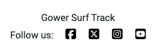

# Testing

## Validation

### HTML

- There were no errors or warnings found when passing the HTML code through the [W3C](https://validator.w3.org/) validator, except for in the sign-up page, which had a few erros due to an unordered list being within a span, which caused the validator to throw an error for tags beofre and after the list. This however was code from the django allauth library, so I am unable to change it.

- This checking was done manually by copying the HTML code from the 'Page Source' and pasting it into the validator, as authentication is required via the URL.

- [Home Page Logged Out User HTML validation report](documentation/validation/logged-out-home-html-validation.png)

- [Home Page Logged In User HTML validation report](documentation/validation/logged-in-home-html-validation.png)

- [My Sessions - No Sessions HTML validation report](documentation/validation/my-sessions-no-sessions-html-validation.png)

- [My Sessions - With Sessions HTML validation report](documentation/validation/my-sessions-with-sessions-html-validation.png)

- [Log Session HTML validation report](documentation/validation/log-session-html-validation.png)

- [Edit Session HTML validation report](documentation/validation/log-session-html-validation.png)

- [Sign Up HTML validation report](documentation/validation/sign-up-html-validation.png)
- [Sign Up Code Error HTML validation report](documentation/validation/sign-up-html-validation-error-code.png)

- [Log In HTML validation report](documentation/validation/log-in-html-validation.png)

- [Log Out HTML validation report](documentation/validation/log-session-html-validation.png)

### CSS

- No errors or warnings were found when passing through the [W3C (Jigsaw)](https://jigsaw.w3.org/css-validator/#validate_by_uri) validator

- [CSS Validation](documentation/validation/css-validation.png)

### JavaScript

No custom JavaScript was used in this project, therefore JavaScript didn't require validation.

### Python

- No errors were found when the code was passed through [CI Python Linter](https://pep8ci.herokuapp.com/). 
- This checking was done manually by copying python code and pasting it into the validator.

- [Surf Sessions - Admin PEP8 validation](documentation/validation/surf-sessions-admin-pep8.png)

- [Surf Sessions - Apps PEP8 validation](documentation/validation/surf-sessions-apps-pep8.png)

- [Surf Sessions - Forms PEP8 validation](documentation/validation/surf-sessions-forms-pep8.png)

- [Surf Sessions - Models PEP8 validation](documentation/validation/surf-sessions-models-pep8.png)

- [Surf Sessions - URLs PEP8 validation](documentation/validation/surf-sessions-urls-pep8.png)

- [Surf Sessions - Views PEP8 validation](documentation/validation/surf-sessions-views-pep8.png)

- [Surf Track - asgi PEP8 validation](documentation/validation/surf-track-asgi-pep8.png)

- [Surf Track - Settings PEP8 validation](documentation/validation/surf-track-settings-pep8.png)

- [Surf Track - URLs PEP8 validation](documentation/validation/surf-track-urls-pep8.png)

- [Surf Track - wsgi PEP8 validation](documentation/validation/surf-track-wsgi-pep8.png)

## Lighthouse Report

- I encountered issues loading the page when running the loghthouse report myself, however someone else was able to run it for me.
- But I have since improved the accessibility

- [Lighthouse Report](documentation/testing/lighthouse-report.png)

## Manual Testing

| Page              | User Actions                                | Expected Results                                           | Y/N | Comments                          |
|-------------------|---------------------------------------------|------------------------------------------------------------|-----|-----------------------------------|
| Home Page         |                                             |                                                            |     |                                   |
| If logged in:     |                                             |                                                            |     |                                   |       
| 1                 | View latest sessions                        | Sessions displayed in reverse chronological order          | Y   |                                   |
| 2                 | Click "View Details" button                 | Opens modal with full session details                      | Y   |                                   |
| 3                 | Click pagination next/previous              | Navigates through sessions                                 | Y   |                                   |
| **Modal**         |                                             |                                                            |     |                                   |
|                   | Click "Close" button                        | Modal closes                                               | Y   |                                   |
|                   | Click outside modal                         | Modal closes                                               | Y   |                                   |
|                   | View session details                        | Full details of surf session displayed                     | Y   |                                   |
|                   | If user is owner, click "My Sessions"       | Redirects to My Sessions page                              | Y   |                                   |
| If logged out:    |                                             |                                                            |     |                                   |
| 1                 | View welcome message                        |                                                            |     |                                   |
| 2                 | Click "Login to View Sessions"              | Redirects to Login page                                    | Y   |                                   |
| 3                 | Click "Sign up here"                        | Redirects to Sign Up page                                  | Y   |                                   |
|-------------------|---------------------------------------------|------------------------------------------------------------|-----|-----------------------------------|
| My Sessions       |                                             |                                                            |     |                                   |
| If sessions:      |                                             |                                                            |     |                                   |
| 1                 | View personal sessions                      | Displays user's surf sessions                              | Y   |                                   |
| 2                 | Click "View Details" button                 | Opens modal with full session details                      | Y   |                                   |
| 3                 | Click "Edit" button                         | Redirects to Edit Session page                             | Y   |                                   |
| 4                 | Click "Delete" button                       | Opens delete confirmation modal                            | Y   |                                   |
| 5                 | Paginate through sessions                   | Displays next or previous set of sessions                  | Y   |                                   |
| **Details Modal** |                                             |                                                            |     |                                   |
|                   | Click "Close" button                        | Modal closes                                               | Y   |                                   |
|                   | Click outside modal                         | Modal closes                                               | Y   |                                   |
|                   | View session details                        | Full details of surf session displayed                     | Y   |                                   |
| **Delete Modal**  | Click "Delete" button                       | Opens delete confirmation modal                            | Y   |                                   |
|                   | Click "Cancel"                              | Modal closes without deletion                              | Y   |                                   |
|                   | Click "Delete"                              | Session is deleted, modal closes, success message dispalyed| Y   |                                   |
|                   | Click outside modal                         | Modal closes                                               | Y   |                                   |
| If no sessions:   |                                             |                                                            |     |                                   |
| 1                 | View no sessions message                    | Displays message informing user of no sessions             | Y   |                                   |
| 2                 | Click "Log Your First Session" button       | Redirects to Log Session page                              | Y   |                                   |
|-------------------|---------------------------------------------|------------------------------------------------------------|-----|-----------------------------------|
| Log Session       |                                             |                                                            |     |                                   |
| 1                 | Visit Log a Session page                    | Form is displayed                                          | Y   |                                   |
| 2                 | Enter valid session details and submit      | Session is saved, success message appears, redirected to Home page| Y   |                            |
| 3                 | Enter invalid session details and submit    | Form reloads with error messages                           | Y   |                                   |
| 4                 | Leave required fields blank                 | Form reloads with error messages                           | Y   |                                   |
|-------------------|---------------------------------------------|------------------------------------------------------------|-----|-----------------------------------|
| Edit Session      |                                             |                                                            |     |                                   |
| 1                 | Visit Edit Session page                     | Form pre-populated with existing session details           | Y   |                                   |
| 2                 | Edit and submit valid session details       | Session is updated, success message appears, redirected to My Sessions page| Y   |                   |
| 3                 | Submit invalid details                      | Form reloads with error messages                           | Y   |                                   |
|-------------------|---------------------------------------------|------------------------------------------------------------|-----|-----------------------------------|
| Log In            |                                             |                                                            |     |                                   |
| 1                 | Click on Log In button                      | Redirects to Log In page                                   | Y   |                                   |
| 2                 | Click on the Sign Up link in the form       | Redirects to Sign Up page                                  | Y   |                                   |
| 3                 | Enter valid username and password           | Redirects to home page with success message                | Y   |                                   |
| 4                 | Enter invalid username and password         | Error message dispalyed                                    | Y   |                                   |
|-------------------|---------------------------------------------|------------------------------------------------------------|-----|-----------------------------------|
| Log Out           |                                             |                                                            |     |                                   |
| 1                 | Click on "Logout" button                    | Redirects to logout confirmation page                      | Y   |                                   |
| 2                 | Confirm logout                              | User is logged out and redirected to home page             | Y   |                                   |
|-------------------|---------------------------------------------|------------------------------------------------------------|-----|-----------------------------------|
| Sign Up           |                                             |                                                            |     |                                   |
| 1                 | Click on Sign Up/Register button            | Redirects to Sign Up page                                  | Y   |                                   |
| 2                 | Click on the Login link in the form         | Redirects to Login page                                    | Y   |                                   |
| 3                 | Enter valid username and password           | User is logged in, redirected to Home page and success message dispalyed| Y   |                      |
| 4                 | Enter invalid username and password         | In line error message is displayed                         | Y   |                                   |
|-------------------|---------------------------------------------|------------------------------------------------------------|-----|-----------------------------------|
| Header            |                                             |                                                            |     |                                   |
| 1                 | Click on the logo                           | Redirects to home page                                     | Y   |                                   |
| 2                 | Click "My Sessions"                         | Redirects to My Sessions page                              | Y   |                                   |
| 3                 | Click "Log Session"                         | Redirects to Log Session page                              | Y   |                                   |
| 4                 | Click "Logout"                              | Redirects to logout page                                   | Y   |                                   |
| 5                 | Click "Sign Up"                             | Redirects to Sign Up page                                  | Y   |                                   |
| 6                 | Click "Login"                               | Redirects to Log In page                                   | Y   |                                   |
| 7                 | User logs in                                | Displays "You are logged in as <username>"                 | Y   |                                   |
| 8                 | User logs out                               | Displays "You are not logged in"                           | Y   |                                   |
|-------------------|---------------------------------------------|------------------------------------------------------------|-----|-----------------------------------|
| Footer            |                                             |                                                            |     |                                   | 
| 1                 | Click on Facebook logo                      | Opens Facebook in a new tab                                | Y   |                                   |
| 1                 | Click on X logo                             | Opens X in a new tab                                       | Y   |                                   |
| 1                 | Click on Instagram logo                     | Opens Insatgram in a new tab                               | Y   |                                   |
| 1                 | Click on YouTube  logo                      | Opens YouTube in a new tab                                 | Y   |                                   |
|-------------------|---------------------------------------------|------------------------------------------------------------|-----|-----------------------------------|
| Admin Page        |                                             |                                                            |     |                                   |
| 1                 | Navigate to `/admin`                        | Redirects to the admin login page                          | Y   |                                   |
| 2                 | Enter valid admin credentials               | Grants access to the admin dashboard                       | Y   |                                   |
| 3                 | Enter invalid credentials                   | Displays error message: "Invalid login credentials"        | Y   |                                   |
| 4                 | Click on the "Users" section                | Displays list of registered users                          | Y   |                                   |
| 5                 | Click on a user entry                       | Allows editing of user details                             | Y   |                                   |
| 6                 | Click "Save" after editing user info        | Updates user information                                   | Y   |                                   |
| 7                 | Click on the "Sessions" section             | Displays list of surf sessions                             | Y   |                                   |
| 8                 | Click on a session entry                    | Allows editing of session details                          | Y   |                                   |
| 9                 | Click "Save" after editing session info     | Updates session information                                | Y   |                                   |
| 10                | Use the search bar to find a user/session   | Filters and displays relevant results                      | Y   |                                   |
| 11                | Click "Add Session"                         | Opens a form to create a new session                       | Y   |                                   |
| 12                | Fill out and submit the form                | New session appears in the list                            | Y   |                                   |
| 13                | Click "Delete" on a session/user            | Prompts for confirmation and deletes entry                 | Y   |                                   |

## User Story Testing

| Site User Goals | Requirement met | Image |
| ------------------------- | --------------- | ----- |
| As a site user I can view a list of all uploaded surf sessions so that I can discover new spots and learn about surf conditions | Y |  |
| As a site user I can log surf sessions so that I can track my progress | Y |   |
| As a site user I can edit or delete my sessions so that I can keep my data accurate and up to date | Y |    |
| As a site user I can sign up and log in so that I can view the sessions of the community | Y |   |
| As a site user I can select a session so that I can view the session in more detail | Y |  |
| As a site user I can view a paginated list of sessions so that I can select which session I want to view | Y |   |
| As a site user I can learn about the platform's features so that I understand the benefits of joining | Y |  |
| As a site user I can view the site on any screen size so that I can have a seamless experience regardless of how or where I access it | Y |   |
| As a site user I can click on social media links so that I can follow the platform's updates, engage with the community, and stay informed about new features or announcements through social channels. | Y |  |
| As a site user I can receive error and success messages so that I know when my actions have either failed or succeeded. | Y |   |

| Site Owner Goals | Requirement met | Image |
| ------------------------- | --------------- | ----- |
| As a site owner I can view all the surf sessions and users so that I can monitor activity on the platform | Y |   |
| As a site owner I can edit or remove sessions so that inappropriate or inaccurate content is removed | Y |   |
| As a site owner I can remove users so that I can manage site activity and behaviour | Y |   |

## Compatibility and Responsiveness

The website was tested on Chrome, Mozilla, Edge and Safari browsers with no problems found.

The responsiveness was checked manually by using devtools (Chrome) throughout the whole development. 
It was also checked with [Responsive Viewer](https://chrome.google.com/webstore/detail/responsive-viewer/inmopeiepgfljkpkidclfgbgbmfcennb/related?hl=en) Chrome extension.

- [Home Page Logged Out User Responsive](documentation/testing/home-logged-out-responsive.png)

- [Home Page Logged In User Responsive](documentation/testing/home-logged-in-responsive.png)

- [My Sessions - No Sessions Responsive](documentation/testing/my-sessions-no-sessions-responsive.png)

- [My Sessions - With Sessions Responsive](documentation/testing/my-sessions-with-sessions-responsive.png)

- [Log Session Responsive](documentation/testing/log-session-responsive.png)

- [Edit Session Responsive](documentation/testing/edit-session-responsive.png)

- [Sign Up Responsive](documentation/testing/sign-up-responsive.png)

- [Log In Responsive](documentation/testing/log-in-responsive.png)

- [Log Out Responsive](documentation/testing/log-out-responsive.png)

## Bugs

### Solved Bugs

**Bug 1**:  
*Issue:*  
When an invalid edit/log session form was submitted, the custom inline error messages weren't displaying.  

*Solution:*  
The form was not re-rendering with the errors because it was outside the conditional that checks for form validity. I updated the view to ensure the form re-renders within the `if not valid` condition, allowing the errors to persist and display properly after submission.  

**Bug 2**:  
*Issue:*  
Error and success messages weren't displaying the correct colors after following the walkthrough for styling.  

*Solution:*  
Upon inspection with DevTools, I noticed that the messages had `error` or `success` classes applied dynamically but lacked the corresponding CSS. I added custom styles to the CSS file to the `error` and `success` classes applying the correct colors.  

**Bug 3**:  
*Issue:*  
The log/edit session form allowed inappropriate values (e.g. future dates and values too high for wind speed and wave height).  

*Solution:*  
I added validation functions to the `forms.py` file for the `date`, `wave_height`, and `wind_speed` fields. These functions prevent invalid entries by raising `ValidationError` when users input inappropriate values. This ensures better control over form input before it reaches the database.  

---

### Unsolved Bugs

**Bug 1**:  
*Issue:*  
Form validation alone does not fully prevent inappropriate entries from being added to the database. Although validations were added to the form, the model still accepts inappropriate values if the form is bypassed.  

*Proposed Solution:*  
I plan to implement additional validation logic directly in the `models.py` file. This will ensure that the database rejects invalid data at the model level, providing a secondary layer of validation beyond the form.

